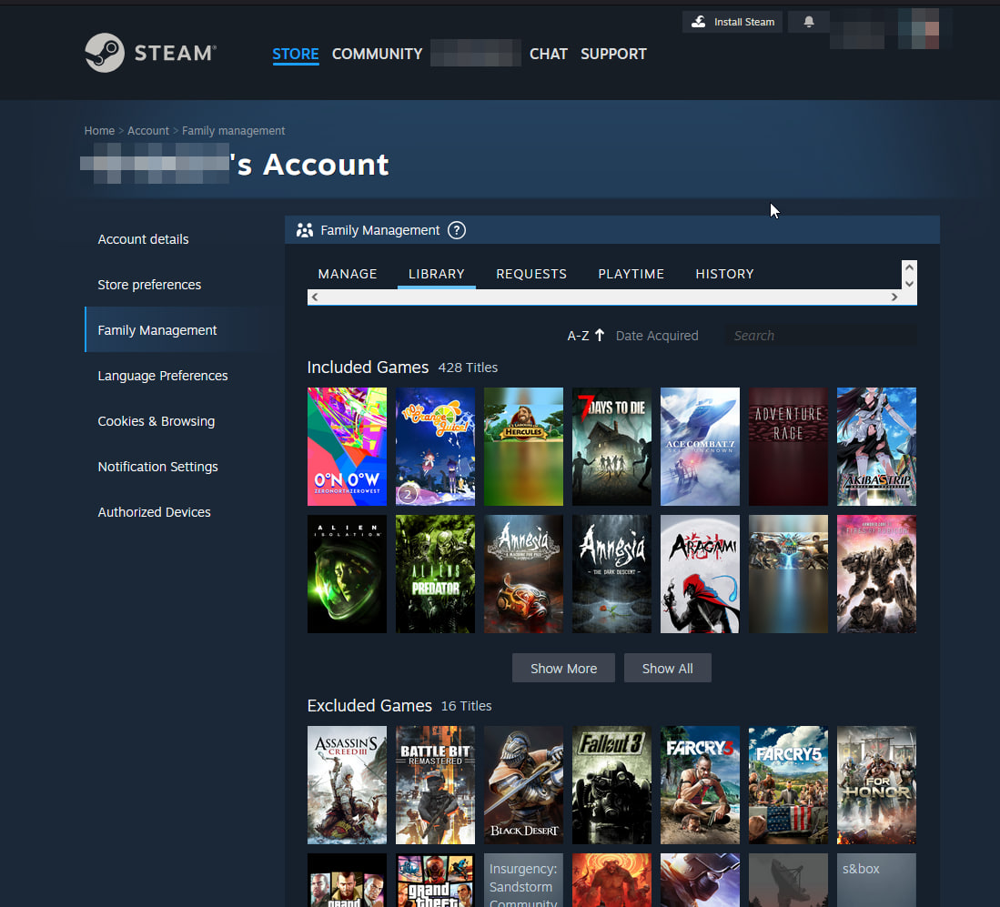
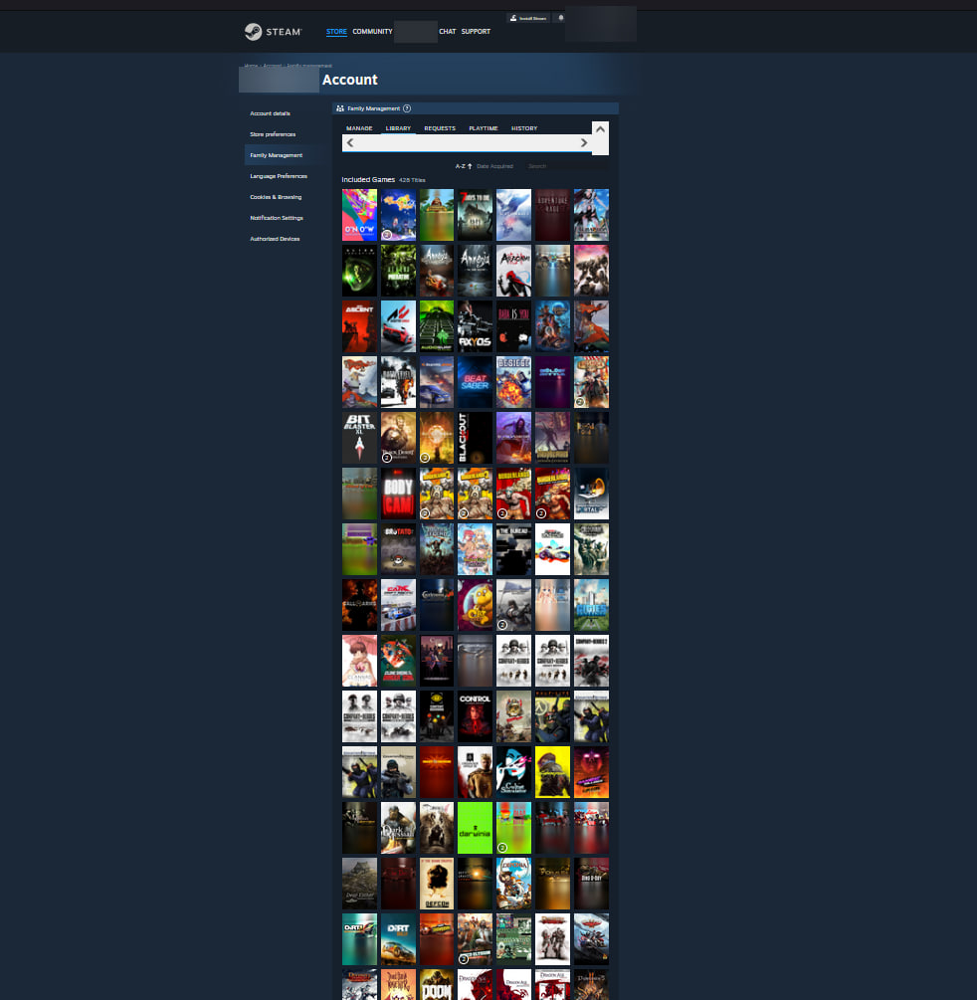
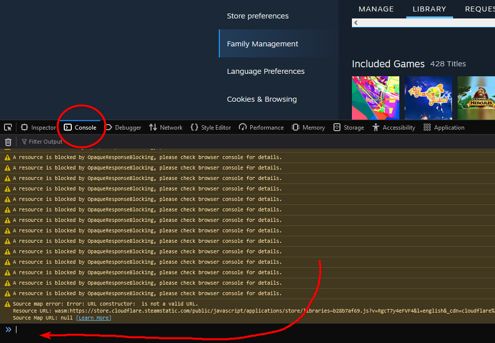
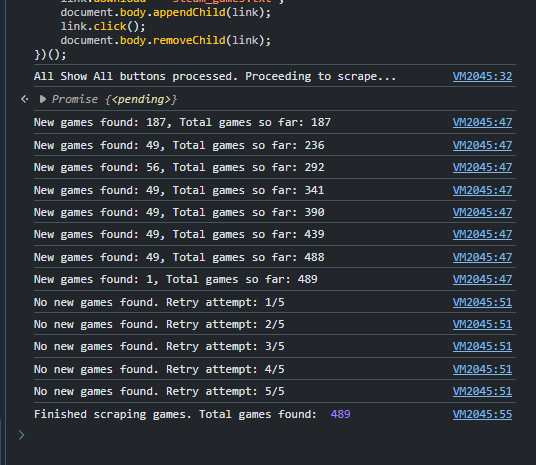

# Steam Game Scraper 

  

This script automatically scrapes the names of all games from your Steam library, including family-shared games. Once the scraping process is complete, the script will save the game names to a `.txt` file and download it.

---

## How to Use

### 1. Open the Steam Family Library Management Page
Open the [Steam Family Library Management](https://store.steampowered.com/account/familymanagement?tab=library) page in your browser.  
(You can also navigate to this page by clicking on your avatar > Account Details > Family Management > Library).  
Here, you should see a list of all your games, including family-shared ones.

#### It should look something like this:

---

### 2. Click "Show All" for Every Category
After opening the page, click **"Show All"** for every category so the script can access all your games.

#### This is what it should look like after you've clicked "Show All":

---

### 3. Scroll to the Top of the Page
Once all games are visible, scroll to the top of the page.

---

### 4. Open the Browser Console
Now, it’s time to run the script. Open the console in your browser. The method to open it may vary depending on the browser you're using:
- **Firefox**: Press `CTRL + SHIFT + K`
- **Chrome**: Press `CTRL + SHIFT + J`

#### Once the console is open, it should look something like this:
While the appearance may vary between browsers, there will be a place where you can paste the script.

---

### 5. Paste and Run the Script
Paste the script into the console and press `ENTER` to run it.  
**The script can be found in the `steamLibraryScraper.js` file**—simply copy it and paste it into the console.

#### If everything was done correctly, you should see the following text in the console:

---

### 6. Wait for the Script to Complete
Now, just wait and don't interact with the page. The script will scroll down, load all the games, and save them to a `.txt` file. Once the script finishes, the download will start automatically.
